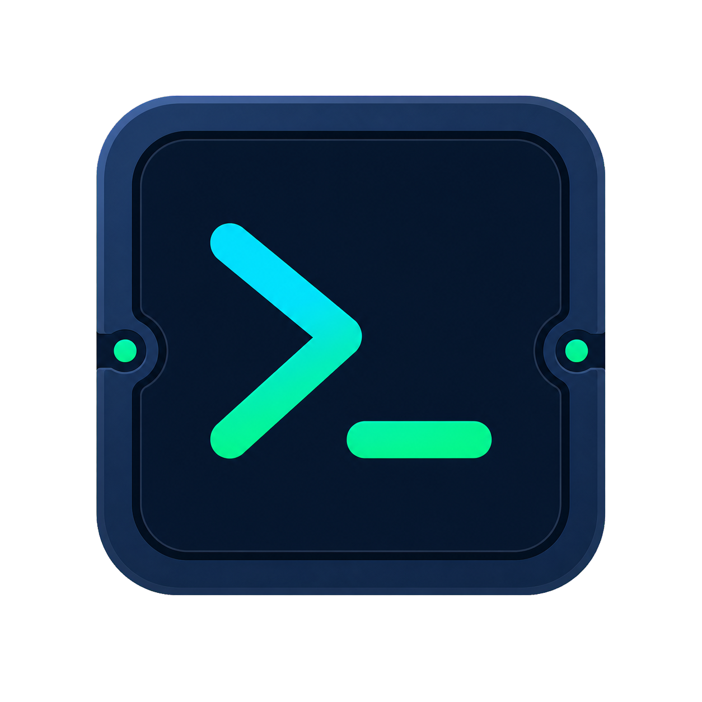
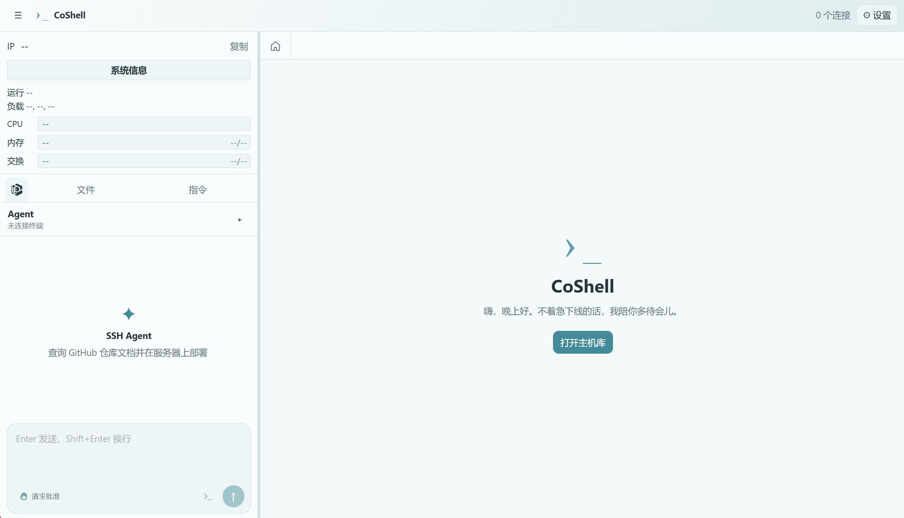

<p align="center">
  
</p>

<h1 align="center">CoShell</h1>

<p align="center">
  <strong>本地优先的桌面 SSH / SFTP 工作台</strong>
</p>

<p align="center">
  在一个应用中完成远程终端、文件管理、在线编辑和 AI 辅助运维。
</p>

<p align="center">
  
  
  
</p>

CoShell 面向个人电脑和可信网络环境。应用默认仅监听本机地址，前端资源与搜索服务均随程序分发，无需浏览器、Docker 或外部 CDN。

<p align="center">
  
</p>

## 功能

| 模块 | 主要能力 |
| --- | --- |
| SSH 终端 | 多标签会话、断开恢复、标签管理、自适应终端尺寸 |
| SFTP 文件管理 | 浏览、上传、下载、新建、移动、复制、重命名和递归删除 |
| 在线编辑 | 语法高亮、自动缩进、括号匹配和原子保存 |
| 连接与密钥 | 服务器配置、SSH 密钥复用、主机指纹校验、快捷命令与脚本 |
| AI Agent | OpenAI 兼容 API、远程命令执行、风险审批、文件与 MCP 工具 |
| 本地搜索 | 内置 SearXNG sidecar，支持聚合搜索与网页内容读取 |
| 数据安全 | Argon2id 密钥派生、AES-GCM 加密、可选 Windows DPAPI 自动解锁 |

## 快速开始

### 使用发行版

可直接从 [GitHub Releases](https://github.com/dreamhartley/CoShell/releases) 下载已经构建好的 Windows x64 便携程序包，无需自行构建。完整解压后运行 `CoShell.exe`，程序无需安装 Python；请勿单独移动 EXE 或直接在压缩包内运行。

首次启动需要创建至少 8 位的保险库主密码。主密码不会写入磁盘，遗失后无法恢复。

### 从源码运行

需要 Python 3.11 或更高版本。在 Windows 上双击 `start-gui.bat`，或运行：

```powershell
.\start.ps1
```

也可以手动创建环境并启动：

```powershell
python -m venv .venv
.\.venv\Scripts\python.exe -m pip install -r requirements.txt
.\.venv\Scripts\python.exe run.py
```

Linux 和 macOS 请使用 `.venv/bin/python`。开发时可运行 `python run.py --web`，然后访问 <http://127.0.0.1:8765>。

## Agent

在“设置 → Agent”中配置 OpenAI 兼容 API 地址、API 密钥和模型。API 密钥会与 SSH 凭据一同加密保存。

连接服务器后，可通过两种方式使用 Agent：

- **侧边栏 Agent**：适合部署、配置、联网查询和多轮任务，可使用 workspace、SFTP 与 MCP 工具。
- **终端 `/agent`**：适合解释和处理当前终端中的报错，默认附带选中内容或上一条命令输出。

常用终端命令：

```text
/agent 帮我解决这个报错
/agent --explain 解释错误原因
/agent --no-context 检查 nginx 状态
/agent 继续
/agent mode
/agent clear
```

Agent 默认使用“请求批准”模式，执行删除、格式化、重启等高风险操作前会等待确认；“完全访问”模式将跳过审批。Agent 具备直接操作远程服务器的能力，使用高权限账号时请谨慎授权。

## 数据与安全

- 桌面服务仅监听 `127.0.0.1` 的随机端口，不应直接暴露到公网。
- 密码、私钥、私钥口令和 API 密钥使用 AES-GCM 加密，密钥由主密码经 Argon2id 派生。
- Windows 用户可启用 DPAPI 自动解锁；绑定信息仅对当前设备和用户有效。
- 首次连接需确认服务器 SHA-256 指纹，已保存的指纹发生变化时会拒绝连接。
- 备份中的敏感数据保持加密，恢复时需要原主密码。
- 打包版数据位于程序目录下的 `data`，升级时应保留该目录。

源码运行时，数据库与 Agent 工作区分别位于 `data/webssh.db` 和 `data/workspace`。本项目按单用户本地应用设计；如需远程开放访问，必须另行配置 HTTPS、身份认证、访问控制和审计。

## 技术栈

- **桌面与后端**：pywebview、FastAPI、Uvicorn
- **SSH / SFTP**：Paramiko
- **前端**：HTML、CSS、Vanilla JavaScript、xterm.js、CodeMirror
- **Agent 与搜索**：OpenAI-compatible API、MCP、SearXNG

## 构建

在 Windows PowerShell 中运行：

```powershell
.\build.ps1
```

构建结果位于 `dist\CoShell`。这是 PyInstaller 目录版，发布时必须将 `CoShell.exe` 与 `_internal` 整体打包。

> 发布包不得包含 `data` 目录。该目录可能保存服务器配置、加密凭据、工作文件和 WebView 数据。建议重新构建后，在首次启动程序之前制作发布压缩包。

## 测试

```powershell
.\.venv\Scripts\python.exe -m pip install -r requirements-dev.txt
.\.venv\Scripts\python.exe -m pytest
```

## 第三方组件

- `static/vendor` 包含 xterm.js、FitAddon 和 CodeMirror，以及对应的 MIT 许可证。
- `third_party/searxng` 包含固定版本的 SearXNG 运行时与对应源码；版本和修改说明见 [BUNDLED_VERSION.txt](third_party/searxng/BUNDLED_VERSION.txt)。

## 许可证

CoShell 主程序采用 [MIT License](LICENSE)。随附的 SearXNG sidecar 采用 [AGPL-3.0-or-later](third_party/searxng/LICENSE)。

友链：[LINUX DO](https://linux.do/)
